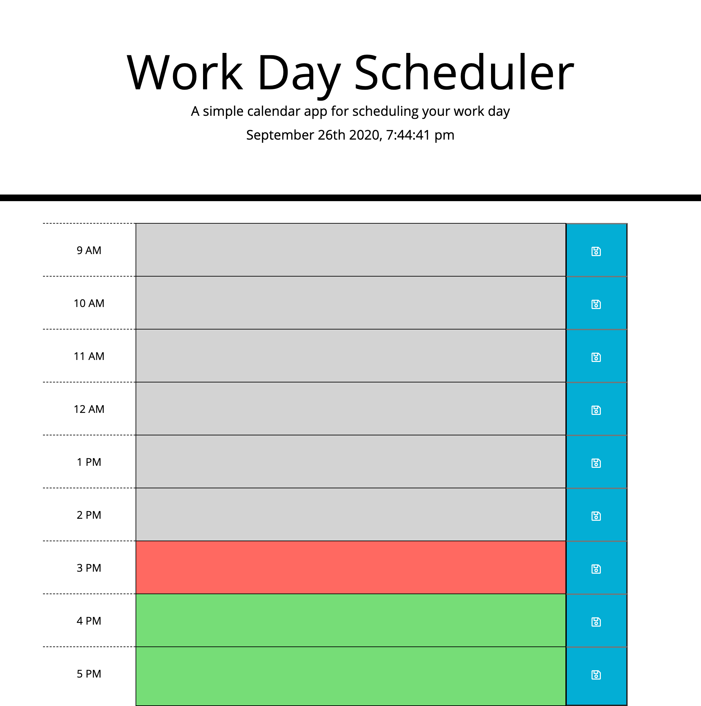

# Workday Scheduler

## Objective

Create a scheduler that response to the time with color coded hours for the past (grey), present (red), and future (green).

 

## Technology Used

* Javascript
* HTML
* CSS
* Visual Studio Code

 

## Description
The text boxes of each hour refresh and change colors based on the current time. It refreshes every second. 

When the user inputs text into the text boxes, the text is recognized and saves to local storage if the adjacent "save" button is clicked. 

If stored to local storage, the text is present on and after page refresh, until text is altered or the local storage is cleared.

 

## Author
Aaron Diggdon

 

## Licence
 

